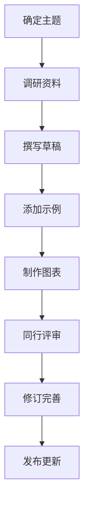

# CLAUDE.md - 机器学习到深度学习演变百科全书

本文档为 Claude Code (claude.ai/code) 提供指导，用于编写和维护“机器学习到深度学习演变百科全书”项目。本项目旨在创建一个通俗易懂、系统全面的机器学习与深度学习教程文档，涵盖从基础算法到前沿发展的完整知识体系。

## 项目概述

### 目标
- **系统梳理**：从传统机器学习到深度学习的完整发展脉络
- **通俗易懂**：用生活化的类比和直观解释降低学习门槛
- **全面覆盖**：涵盖基础算法、核心概念、关键模型和应用场景
- **持续更新**：跟踪最新技术发展，保持内容的前沿性

### 受众群体
- 机器学习初学者，希望系统掌握基础知识
- 有一定经验的开发者，希望深入理解算法原理
- 教育工作者，寻找教学参考资料
- 技术爱好者，了解人工智能发展历程

## 文档结构

```
ml-dl-encyclopedia/
├── README.md                    # 项目总览和快速入门
├── SUMMARY.md                   # 文档目录（用于GitBook等工具）
├── CONTRIBUTING.md              # 贡献指南
├── docs/
│   ├── 01-introduction/         # 引言部分
│   │   ├── 01-what-is-ml.md     # 什么是机器学习
│   │   ├── 02-ml-vs-dl.md       # 机器学习 vs 深度学习
│   │   └── 03-history-overview.md # 历史发展概述
│   ├── 02-mathematics/          # 数学基础
│   │   ├── 01-linear-algebra.md # 线性代数基础
│   │   ├── 02-probability.md    # 概率论基础
│   │   ├── 03-calculus.md       # 微积分基础
│   │   └── 04-optimization.md   # 优化理论
│   ├── 03-traditional-ml/       # 传统机器学习算法
│   │   ├── 01-linear-regression.md      # 线性回归
│   │   ├── 02-logistic-regression.md    # 逻辑回归
│   │   ├── 03-decision-trees.md         # 决策树
│   │   ├── 04-random-forest.md          # 随机森林
│   │   ├── 05-svm.md                    # 支持向量机
│   │   ├── 06-knn.md                    # K近邻算法
│   │   ├── 07-clustering.md             # 聚类算法
│   │   ├── 08-naive-bayes.md            # 朴素贝叶斯
│   │   └── 09-model-evaluation.md       # 模型评估方法
│   ├── 04-neural-networks/      # 神经网络基础
│   │   ├── 01-perceptron.md             # 感知机
│   │   ├── 02-mlp.md                    # 多层感知机
│   │   ├── 03-backpropagation.md        # 反向传播算法
│   │   ├── 04-gradient-descent.md       # 梯度下降
│   │   ├── 05-activation-functions.md   # 激活函数
│   │   ├── 06-regularization.md         # 正则化技术
│   │   └── 07-optimizers.md             # 优化器
│   ├── 05-deep-learning/        # 深度学习算法
│   │   ├── 01-cnn/                      # 卷积神经网络
│   │   │   ├── 01-introduction.md       # CNN简介
│   │   │   ├── 02-convolution-layer.md  # 卷积层
│   │   │   ├── 03-pooling-layer.md      # 池化层
│   │   │   └── 04-applications.md       # 应用场景
│   │   ├── 02-rnn/                      # 循环神经网络
│   │   │   ├── 01-introduction.md       # RNN简介
│   │   │   ├── 02-lstm.md               # LSTM网络
│   │   │   ├── 03-gru.md                # GRU网络
│   │   │   └── 04-applications.md       # 应用场景
│   │   ├── 03-transformer/              # Transformer架构
│   │   │   ├── 01-introduction.md       # Transformer简介
│   │   │   ├── 02-attention-mechanism.md # 注意力机制
│   │   │   ├── 03-encoder-decoder.md    # 编码器-解码器
│   │   │   └── 04-applications.md       # 应用场景
│   │   ├── 04-gan/                      # 生成对抗网络
│   │   │   ├── 01-introduction.md       # GAN简介
│   │   │   ├── 02-generator-discriminator.md # 生成器与判别器
│   │   │   └── 03-applications.md       # 应用场景
│   │   └── 05-autoencoders/             # 自编码器
│   │       ├── 01-introduction.md       # 自编码器简介
│   │       └── 02-variational-autoencoders.md # 变分自编码器
│   ├── 06-milestone-models/     # 里程碑模型
│   │   ├── 01-alexnet.md                # AlexNet (2012)
│   │   ├── 02-vggnet.md                 # VGGNet (2014)
│   │   ├── 03-googlenet.md              # GoogLeNet (2014)
│   │   ├── 04-resnet.md                 # ResNet (2015)
│   │   ├── 05-transformer.md            # Transformer (2017)
│   │   ├── 06-bert.md                   # BERT (2018)
│   │   ├── 07-gpt-series.md             # GPT系列 (2018-2023)
│   │   └── 08-diffusion-models.md       # 扩散模型 (2020-)
│   ├── 07-practical-guide/      # 实践指南
│   │   ├── 01-data-preprocessing.md     # 数据预处理
│   │   ├── 02-feature-engineering.md    # 特征工程
│   │   ├── 03-model-selection.md        # 模型选择
│   │   ├── 04-hyperparameter-tuning.md  # 超参数调优
│   │   ├── 05-training-strategies.md    # 训练策略
│   │   ├── 06-deployment.md             # 模型部署
│   │   └── 07-ethics-responsibility.md  # 伦理与责任
│   ├── 08-applications/         # 应用领域
│   │   ├── 01-computer-vision.md       # 计算机视觉
│   │   ├── 02-natural-language-processing.md # 自然语言处理
│   │   ├── 03-speech-recognition.md    # 语音识别
│   │   ├── 04-recommendation-systems.md # 推荐系统
│   │   ├── 05-autonomous-driving.md    # 自动驾驶
│   │   └── 06-healthcare.md            # 医疗健康
│   └── 09-resources/            # 学习资源
│       ├── 01-books.md                  # 推荐书籍
│       ├── 02-courses.md                # 在线课程
│       ├── 03-papers.md                 # 重要论文
│       ├── 04-datasets.md               # 常用数据集
│       ├── 05-tools-frameworks.md       # 工具和框架
│       └── 06-communities.md            # 社区和论坛
├── examples/                     # 代码示例（可选）
│   ├── python/
│   │   ├── linear_regression.py
│   │   ├── decision_tree.py
│   │   └── cnn_mnist.py
│   └── jupyter-notebooks/
│       ├── 01-linear-regression.ipynb
│       └── 02-cnn-basics.ipynb
├── images/                      # 图片资源
│   ├── diagrams/                # 原理图
│   └── screenshots/             # 效果截图
└── glossary/                    # 术语表
    ├── english-chinese.md       # 英汉术语对照
    └── index.md                 # 术语索引
├── exams/                       # 测试卷（每节一测 + 每章一测）
│   ├── README.md                # 试卷使用说明
│   ├── 02-mathematics/          # 第二章试卷
│   │   ├── 01-linear-algebra-题目.md
│   │   ├── 01-linear-algebra-答案解析.md
│   │   ├── ...
│   │   ├── 章节测验-题目.md
│   │   └── 章节测验-答案解析.md
│   ├── 03-traditional-ml/       # 第三章试卷
│   │   ├── 01-linear-regression-题目.md
│   │   ├── 01-linear-regression-答案解析.md
│   │   ├── ...
│   │   ├── 章节测验-题目.md
│   │   └── 章节测验-答案解析.md
│   └── ...                      # 其余章节同理
```

## 写作规范

### 1. 内容质量要求
- **准确性**：所有技术内容必须准确无误，引用可靠来源
- **易懂性**：使用通俗易懂的语言，避免过度学术化
- **结构化**：每篇文章遵循“概述-原理-应用-总结”结构
- **一致性**：术语使用前后一致，符合行业标准

### 2. 格式规范
- **文件命名**：使用英文小写字母和连字符，如 `linear-regression.md`
- **标题层级**：使用 Markdown 的 `#` 表示标题层级，最多使用四级标题
- **代码块**：使用 ``` 标注代码块，并指定语言类型
- **图片引用**：所有图片放在 `images/` 目录下，使用相对路径引用
- **参考文献**：在文章末尾添加参考资料列表

### 3. 风格指南
- **语言风格**：亲切但不随意，专业但不晦涩
- **举例说明**：每个复杂概念至少提供一个生活化例子
- **可视化表达**：尽可能使用图表、流程图辅助说明
- **避免偏见**：客观介绍各种算法的优缺点，不偏袒特定技术

### 4. 特殊元素标记
```markdown
> **定义**：用于强调核心概念的定义
> 
> **示例**：用于展示具体的计算或应用示例
> 
> **注意**：用于提醒读者重要的注意事项
> 
> **提示**：用于提供实用的小技巧或建议
> 
> **警告**：用于指出常见的错误或陷阱
```

### 5. 教学理念：费曼学习法与故事化教学

本项目不仅是"知识仓库"，更是一套**会提问、会讲故事**的教学体系。每篇文章除了传授知识，还必须做到两件事：**让读者学会提问**（费曼学习法）和**让概念住进脑子**（寓言故事）。

#### 🧠 费曼学习法：用提问驱动学习

> "如果你不能简单地解释一件事，说明你还没有真正理解它。" —— 理查德·费曼

费曼学习法的四步循环：
1. **选择概念**：确定要学习的核心概念
2. **教给小白**：用最朴素的语言向一个"12岁孩子"解释
3. **发现卡壳**：解释不清的地方，就是理解的漏洞
4. **回顾简化**：回到源头补漏，再用类比和故事重新表述

**落地到每篇文章的三处提问设计：**
- **开篇悬念式提问**：制造认知冲突（例："为什么模型在训练集上考满分，一到考试就不及格？"）
- **关键概念后的 🧠 费曼自问**：引导读者用自己的话复述（例："如果只能用一句话向奶奶解释梯度下降，你会怎么说？"）
- **文末 🧠 费曼自测**：3-5 道引导性问题，倒逼读者把知识讲出来，而非被动阅读

#### 📖 寓言故事：用叙事承载抽象概念

抽象算法很难记住，但故事会自己"住进"读者脑子里。为每个核心概念设计一个**寓言故事**，让概念在故事中自然浮现。

**写作要领：**
- **拟人化**：把抽象概念变成角色（梯度是"山坡上的盲人"，过拟合是"只会背题的学生"）
- **冲突驱动**：故事要有困境、选择、转折，而非平铺直叙
- **点题收尾**：故事结尾用一句话回到技术概念，点明"寓言的寓意"
- **篇幅适度**：150-400 字为宜，服务于理解而非炫技

**经典寓言示例（概念 → 故事）：**
- 梯度下降 → 「盲人下山」：盲人在浓雾中寻找山谷最低点，只能靠脚底坡度判断方向
- 过拟合 → 「死记硬背的考生」：背下所有历年真题，遇到新题却不会做
- 正则化 → 「奥卡姆剃刀」：老师惩罚花哨复杂的答案，鼓励简洁
- 决策树 → 「二十个问题」：通过不断问"是/否"来锁定答案
- 集成学习 → 「三个臭皮匠」：一群普通人的集体判断胜过单个专家
- 卷积 → 「放大镜扫描」：用同一枚放大镜扫过整幅画，寻找局部特征
- 注意力机制 → 「图书馆里的查书」：面对一堆书，先判断哪几本最相关

### 6. 故事化叙事节奏

每篇文章应遵循"**悬念 → 探索 → 顿悟**"的叙事弧线：

```
开篇：抛出一个反直觉的问题或现象（制造悬念）
  ↓
正文：层层递进地探索原理（读者跟着"寻宝"）
  ↓
寓言：用一个故事把抽象概念"演"出来（情感共鸣）
  ↓
费曼自测：引导读者用自己的话讲出来（真正掌握）
```

> **提示**：好的教学文章读完后的感觉，应该像看了一场精彩的悬疑片——带着问题进来，带着答案和故事离开。

### 7. 测试卷规范（学完即测）

每篇文章（每节）配套一份**节末小测**，每个大章节配套一份**章节综合卷**。每份试卷必须**成对出现**：一份纯题目（给学习者做），一份带答案与详细分析（用于对答案和自省）。

**存放位置**：`exams/` 目录（与 `docs/` 平级），按章节编号组织：
```
exams/03-traditional-ml/
├── 01-linear-regression-题目.md      # 节末小测（题目）
├── 01-linear-regression-答案解析.md  # 节末小测（答案+分析）
├── ...
├── 章节测验-题目.md                   # 章节综合卷（题目）
├── 章节测验-答案解析.md               # 章节综合卷（答案+分析）
├── 挑战卷-题目.md                     # 挑战卷（难题，题目）
├── 挑战卷-答案解析.md                 # 挑战卷（难题，答案+分析）
├── 压力面-题目.md                     # 公司压力面问题（题目）
└── 压力面-答案解析.md                 # 公司压力面问题（答案+分析）
```

**节末小测（每节约 8-10 题）**
- 选择题 5-6 题：考察核心概念、易混淆点、常见误区
- 简单计算题 2-3 题：直接套用公式的入门计算
- 中等计算题 1-2 题：需要多步推导的综合计算

**章节综合卷（每章约 15-18 题）**
- 选择题 8-10 题：串联全章概念，侧重对比与辨析
- 简单计算题 4-5 题：覆盖各节基础计算
- 中等计算题 3-4 题：跨知识点综合计算
- （可选）简答/应用题 1 题：开放性的理解题

**挑战卷（每章一套，约 8-10 题）**
- 定位：对标 C9 高校期末压轴题、研究生入学考试、机器学习竞赛题，**难度高于章节综合卷**
- 题型：
  - 高难度选择题 3-4 题：考察进阶概念辨析、数学细节（如"哪个说法严格成立"）
  - 复杂计算题 3-4 题：需要多步推导、综合多个知识点
  - 证明/推导题 1-2 题：如推导梯度公式、证明算法性质
  - 开放性思考题 1 题：无标准答案，考察思维深度
- 文件命名：`挑战卷-题目.md`、`挑战卷-答案解析.md`

**公司压力面问题（每章一套，约 10-12 问）**
- 定位：模拟字节、腾讯、阿里、美团等大厂 ML 岗**压力面试**，考察深度理解与工程实践
- 特点：面试官**层层追问**、**质疑挑战**、**考察临场反应**
- 每问结构：
  - 面试官提问（可能含陷阱）
  - 答案解析版中：参考答案 + 面试官可能的追问 + 踩坑点（常见错误回答）
- 覆盖方向：概念深度追问、工程落地细节、算法对比选型、数学原理、场景陷阱
- 文件命名：`压力面-题目.md`、`压力面-答案解析.md`

**题目来源（四类必考）**
1. **C9 高校相关试卷**：改编自清华、北大、浙大、上交、复旦、南大、中科大、哈工大、西交大等高校《机器学习》《模式识别》课程试题
2. **科技公司面试题**：改编自字节、腾讯、阿里、百度、美团等大厂 ML 岗面试真题
3. **易混淆点**：专门针对"听起来像但不一样"的概念（如精确率 vs 召回率、L1 vs L2、Bagging vs Boosting）
4. **易错点**：针对新手最常犯的错误（如不标准化就上 KNN、用 MSE 训练逻辑回归）

**答案与解析文件要求**
- 每道题给出：**正确答案 + 详细解析 + 考点 + 易错点提示**
- 计算题必须写出**完整推导步骤**，不能只给结果
- 选择题要说明**每个选项对/错的原因**（尤其是干扰项为什么错）
- 文件开头给出**考点分布表**，方便自测后定位薄弱环节

> **提示**：试卷不是"考倒学生"，而是"帮助查漏补缺"。解析要像一位耐心的老师，把每个错选背后的认知误区点出来。

## 开发工作流

### 1. 内容创建流程


### 2. 协作规范
- **分支策略**：每篇文章在独立分支开发，通过 Pull Request 合并
- **评审流程**：每篇文章至少经过一人评审
- **版本控制**：使用语义化版本号标记重大更新

### 3. 质量保证
- **技术审核**：确保技术内容的准确性
- **语言润色**：提高文章的可读性和流畅度
- **链接检查**：确保所有内部和外部链接有效
- **移动端适配**：确保在移动设备上阅读体验良好

## 技术工具

### 1. 文档工具
- **编辑工具**：VS Code、Typora、Obsidian
- **版本控制**：Git + GitHub/GitLab
- **构建工具**：MkDocs、GitBook、Docusaurus（可选）
- **图表工具**：Draw.io、Excalidraw、Mermaid

### 2. 质量检查工具
- **拼写检查**：Code Spell Checker
- **语法检查**：Grammarly（英文）、中文校对工具
- **链接检查**：markdown-link-check
- **格式检查**：Prettier、markdownlint

### 3. 自动化流程
- **CI/CD**：自动构建和部署文档网站
- **链接检查**：定期检查失效链接
- **内容更新**：定期审核和更新过时内容

## 贡献指南

### 1. 如何贡献
1. Fork 本仓库
2. 创建特性分支 (`git checkout -b feature/amazing-article`)
3. 提交更改 (`git commit -m 'Add some amazing article'`)
4. 推送到分支 (`git push origin feature/amazing-article`)
5. 开启 Pull Request

### 2. 贡献类型
- **新文章**：撰写新的教程文章
- **内容更新**：更新过时或错误的内容
- **翻译**：将文章翻译成其他语言
- **示例代码**：添加或改进代码示例
- **图表制作**：制作原理图或示意图
- **校对润色**：改进文章的语言表达

### 3. 文章模板
每篇文章应包含以下部分（**加粗为特色教学模块，必选**）：
```
# 文章标题

## 概述
- 用一个**悬念式提问**开篇，制造认知冲突
- 说明学习本篇文章的目的

## 历史背景
- 算法/概念的起源和发展
- 关键人物和时间节点

## 核心原理
- 算法的数学原理
- 关键公式和推导
- 核心思想解释
- 关键概念后穿插 🧠 费曼自问

## 通俗解释
- 生活化的类比
- 直观的比喻
- 简单示例说明

## 📖 寓言故事
- 一个150-400字的寓言，把核心概念"演"出来
- 结尾点明寓意，回到技术概念

## 算法步骤
1. 第一步
2. 第二步
3. ...

## 优缺点分析
### 优点
- 优点1
- 优点2

### 缺点
- 缺点1
- 缺点2

## 应用场景
- 适用场景1
- 适用场景2

## 实践建议
- 使用时的注意事项
- 常见问题和解决方案

## 🧠 费曼自测
1. 如果只用一句话向一个12岁孩子解释这个算法，你会怎么说？
2. 这个算法解决的核心问题是什么？它和上一个算法有何不同？
3. 举一个你生活中能用到这个算法的例子
4. （可选）试着解释一个容易混淆的细节

## 总结
- 关键要点回顾
- 进一步学习方向

## 参考文献
1. [文献1](链接)
2. [文献2](链接)

## 相关链接
- [下一篇：相关主题](链接)
- [上一篇：前置知识](链接)
```

## 更新与维护

### 1. 定期审核
- **每月**：检查外部链接的有效性
- **每季度**：审核技术内容的时效性
- **每年**：全面评估文档结构和内容覆盖

### 2. 版本记录
使用语义化版本号记录重大更新：
- **主版本号**：文档结构重大调整
- **次版本号**：新增重要章节或算法
- **修订号**：内容修正和优化

所有版本变更统一记录在项目根目录的 **[`DEVELOPMENT_LOG.md`](DEVELOPMENT_LOG.md)**（开发日志）中。

**维护开发日志的规则：**
1. **每次更新必记**：完成一批内容后，在日志顶部按倒序追加一条版本记录
2. **同步待办清单**：更新日志文末的 TODO 清单，勾选已完成项
3. **记录四要素**：每条记录至少包含"主题、新增、修改、删除"
4. **记录要具体**：正文需列出新增的每篇文章文件名；试卷需列出套数

### 3. 反馈机制
- **问题反馈**：通过 GitHub Issues 报告问题
- **内容建议**：通过 Discussions 提出改进建议
- **错误修正**：通过 Pull Request 直接修正错误

## 许可证

本项目内容采用 [知识共享署名-非商业性使用-相同方式共享 4.0 国际许可协议](https://creativecommons.org/licenses/by-nc-sa/4.0/) 进行许可。

代码示例采用 MIT 许可证。

---

**最后更新**：2026年4月11日

**维护者**：机器学习到深度学习演变百科全书项目组

**项目状态**：活跃开发中

---

> **提示**：使用 Claude Code 时，可以通过 `cd "E:\cc"` 切换到本项目目录，然后使用 `claude` 命令获取针对本项目的具体指导。